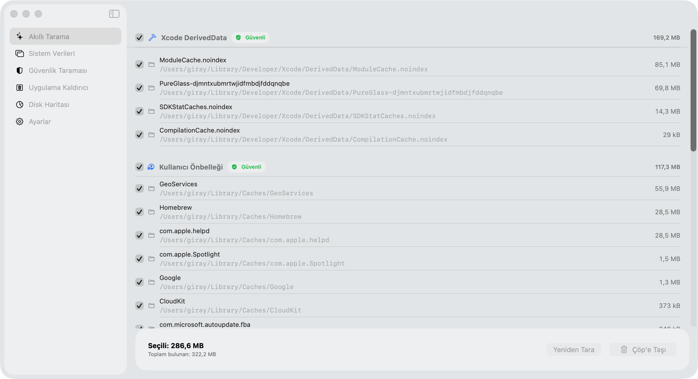
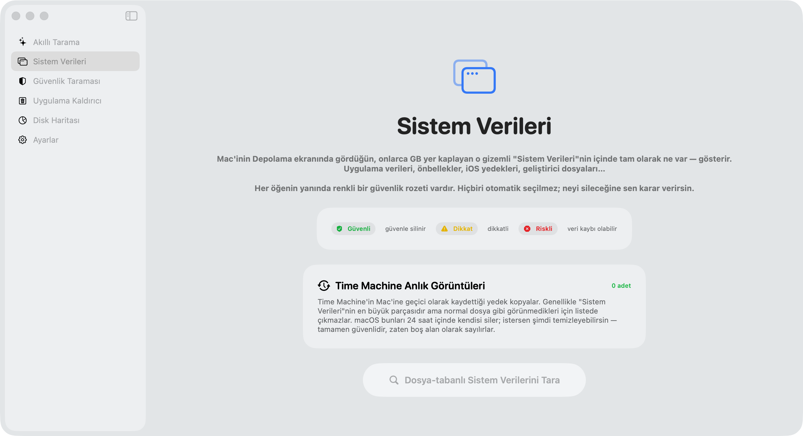
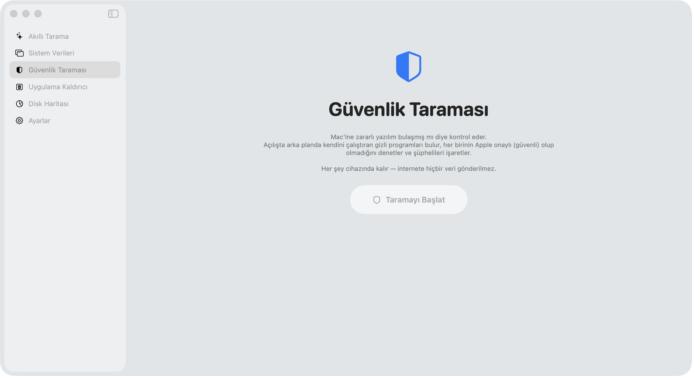
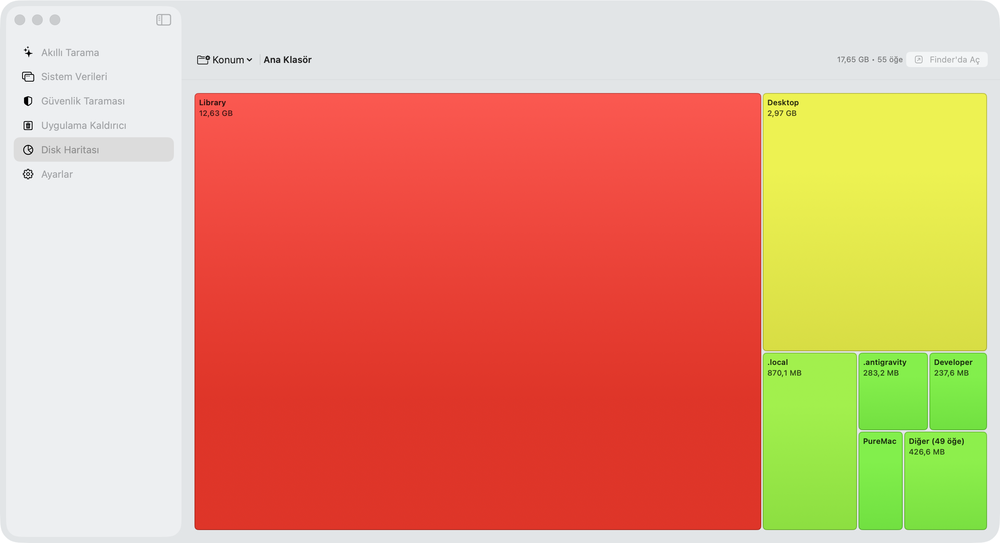
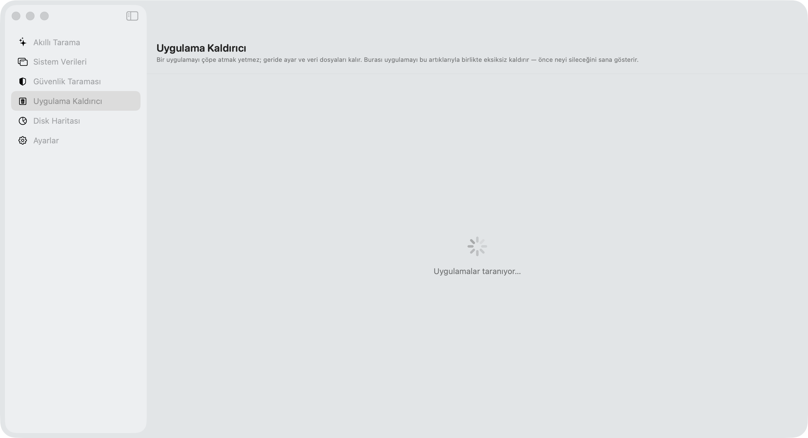

<div align="center">

# ✨ PureGlass

### The native, **real Liquid Glass** Mac cleaner — free, private, and open source.

PureGlass finds what wastes your space, shows you **every single file path** before touching it,
and never sends a byte to the internet. Built from scratch in SwiftUI for **macOS 26 (Tahoe)** with
Apple's genuine **Liquid Glass** material — not a glassmorphism fake.



</div>

---

## Why PureGlass?

Most Mac cleaners are either **expensive** (CleanMyMac is $39.95/yr), **closed-source with telemetry**, or
**CLI-only**. PureGlass was built on three principles:

- 🔒 **Privacy first** — 100% offline. No telemetry, no accounts, no network access. Ever.
- 🪟 **Real Liquid Glass** — the genuine macOS 26 `.glassEffect()` material + a fully transparent menu-bar panel.
- 👁️ **Total transparency** — you see the **exact path, size and risk level** of everything before it's removed,
  and every deletion goes to the **Trash** (recoverable), shown live as it happens.

> **Honest by design.** PureGlass tells you the truth: which files are safe, which are risky, and which system
> data simply **cannot** be deleted by *any* tool (it shows you those too, with their sizes).

---

## Screenshots

### 🗂️ System Data — finally, what's *actually* inside it
macOS hides tens of GB under a mysterious "System Data" category. PureGlass breaks it down by **risk level**
(🟢 safe · 🟡 caution · 🔴 risky), pre-selects **nothing** (you choose), and even shows the
**undeletable** system areas with their real sizes.



### 🛡️ Security Scan — code-signature malware detection
Uses the **KnockKnock methodology**: enumerates persistence locations (launch agents/daemons, `~/.zshrc`,
cron, emond, hosts) and verifies the **code signature** of every persistent executable. Apple/Developer-ID
signed items are trusted; unsigned / ad-hoc / broken-signed items are flagged. 100% local.



### 🗺️ Disk Map — full-disk heatmap treemap
A squarified treemap where **box size = disk usage** and **color = how full** (🔴 huge → 🟢 small).
Click any folder to drill in. A location picker jumps to the whole disk (`/`), Homebrew, `/Library/Developer`,
and more — so you can actually find the 60 GB hiding in your Xcode simulators. *(CleanMyMac has no treemap.)*



### 🧹 App Uninstaller — with leftover detection
Trashing an app isn't enough — it leaves caches, preferences and container data behind. PureGlass finds the
app **and** all its leftovers by bundle ID, and shows you exactly what it will remove.



---

## How PureGlass compares

| | **PureGlass** | CleanMyMac | Mac Sai | Pearcleaner | PureMac | OnyX |
|---|:---:|:---:|:---:|:---:|:---:|:---:|
| **Price** | **Free** | $39.95/yr | Free | Free | Free | Free |
| **Open source** | ✅ MIT | ❌ | ✅ BSD-3 | ✅ | ✅ MIT | ❌ |
| **Telemetry** | ✅ **None** | ⚠️ Yes | None | None | None | None |
| **Real Liquid Glass UI** (macOS 26) | ✅ **Only PureGlass** | ❌ | ❌ | ❌ | ❌ | ❌ |
| **Transparent menu-bar panel + live disk** | ✅ | menu only | ✅ | ❌ | ❌ | ❌ |
| **Smart Scan (one-click)** | ✅ | ✅ | ✅ | ❌ | partial | ❌ |
| **System Junk** | ✅ | ✅ | ✅ | — | ✅ | limited |
| **System Data breakdown + undeletable sizes** | ✅ **Unique** | ❌ | ❌ | ❌ | ❌ | ❌ |
| **Malware scanner** (code-signature) | ✅ | ✅ | ✅ | ❌ | ❌ | ❌ |
| **Uninstaller w/ leftover detection** | ✅ | ✅ | ✅ 10-lvl | ✅ | ❌ | ❌ |
| **Disk treemap visualizer** | ✅ **full-disk** | ❌ | ✅ | ❌ | ❌ | ❌ |
| **Live per-file deletion log** | ✅ | ❌ | ✅ | ❌ | ❌ | ❌ |
| **Risk classification + manual control** | ✅ | partial | ✅ | ✅ | — | — |
| **Trash-first (recoverable)** | ✅ | ✅ | ✅ | ✅ | ✅ | — |
| **Time Machine snapshot mgmt** | ✅ | ✅ | ✅ | ❌ | ❌ | ✅ |
| Duplicate finder | 🚧 roadmap | ✅ | ✅ | ❌ | ❌ | ❌ |
| Maintenance scripts | 🚧 roadmap | ✅ | ✅ | ❌ | ❌ | ✅ strong |

**Where PureGlass leads:** the only one with **real Liquid Glass**, a **fully transparent** menu-bar panel,
an honest **System Data breakdown** (including the undeletable part), a **full-disk treemap** (CleanMyMac has
none), **code-signature** malware detection, and a **live per-path deletion log** — all **free, offline and
open source**, with no telemetry.

---

## Features

- **Smart Scan** — caches, logs and temp files, one click, nothing deleted without your OK.
- **System Data** — risk-classified breakdown of the giant "System Data" category, fully manual selection,
  plus a read-only list of the **undeletable** system areas with sizes, plus Time Machine snapshot management.
- **Security Scan** — KnockKnock-style persistence + code-signature malware detection, fully offline.
- **App Uninstaller** — removes apps with all their leftovers (caches, prefs, containers, logs).
- **Disk Map** — full-disk squarified treemap heatmap with drill-down and a quick location picker.
- **Menu-bar panel** — a transparent Liquid Glass panel with **live disk metrics (refreshed every second)** and
  quick actions; a "System Settings → Storage" shortcut.
- **Live deletion log** — every path scrolls by as it's trashed.
- **Risk badges** everywhere (🟢 safe · 🟡 caution · 🔴 risky) and a confirmation prompt before any risky delete.
- **Deep clean** (optional) — system caches/logs via a single admin-password prompt; system items are validated
  against a stricter safety guard and the command is injection-safe.

---

## Requirements

- macOS **26.0+** (Tahoe) — required for the Liquid Glass material
- Apple Silicon
- To build: Xcode **26+** and [XcodeGen](https://github.com/yonaskolb/XcodeGen) (`brew install xcodegen`)

> The UI is currently in **Turkish**; localization PRs are welcome.

## Build & Run

```bash
git clone https://github.com/GRJY/PureGlass.git
cd PureGlass
xcodegen generate          # generate PureGlass.xcodeproj from project.yml
open PureGlass.xcodeproj    # then ⌘R in Xcode

# or a packaged .dmg:
./scripts/build-release.sh # → build/PureGlass.dmg
```

The app is **non-sandboxed** (required for Full Disk Access) and distributed outside the App Store. Because it
is not notarized (no paid Apple Developer account), the first launch may need **right-click → Open**.

## Architecture

```
Sources/
  App/            Entry point, transparent window, menu-bar status panel
  DesignSystem/   Liquid Glass components (GlassCard, RiskBadge, ProgressRing, LiveLogPanel…)
  Features/       View models + screens (Smart Scan, System Data, Security, Uninstaller, Disk Map…)
  Core/           = PureGlassKit framework (UI-independent, unit-tested):
    LocationsDatabase     single source of truth for scan paths (category + risk)
    SafetyGuard           last-line delete guard (blocklist + symlink/TOCTOU)
    ScanEngine            concurrent, cancellable scanning
    CleaningEngine        trash-first deletion with live events
    CodeSignatureInspector  Security-framework signing verification (KnockKnock)
    ThreatScanner         persistence + malware heuristics
    DiskMapScanner / TreemapLayout   squarified treemap
    AppUninstaller        app + leftover discovery
Tests/            69 unit tests (safety, scan, clean, signing, treemap, uninstaller…)
```

## Safety & Privacy

- **Never touched:** `/System`, `/usr`, `/bin`, Apple apps, anything SIP-protected.
- Every delete is validated by `SafetyGuard` (blocklist + safe-root + symlink/TOCTOU) **immediately before** removal.
- User files go to the **Trash** (recoverable). Root-owned system caches are permanently removed only after an
  explicit confirmation + admin password.
- **No telemetry, no network, no accounts.** Everything stays on your Mac.

## Honest limits

- macOS **SIP-protected system files cannot be deleted by any tool** (not even with Full Disk Access). PureGlass
  shows these as read-only "undeletable system data" with sizes rather than pretending it can remove them.
- Not notarized (no paid Apple Developer account) → manual first-launch approval.

## Roadmap

- Duplicate finder · Maintenance scripts · Universal Binary thinning · Browser privacy cleaner · English/i18n.

## License

[MIT](LICENSE) © Giray Akbulut

<div align="center">
<sub>Built with SwiftUI for macOS 26 · 100% offline · no telemetry</sub>
</div>
